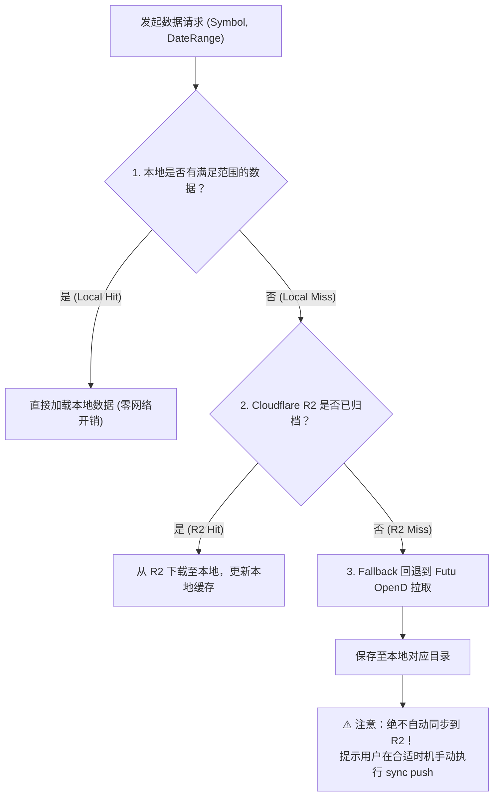

# Cloudflare R2 行情数据同步与获取规范 (r2-market-data)

本 Skill 规范了美股时序行情数据在 **本地（Local）**、**云端对象存储（Cloudflare R2）** 以及 **券商接口（Futu OpenD）** 之间的分层获取与手动同步机制。

---

## 一、核心数据获取策略 (Data Fetching Strategy)

为最大程度节省 Futu 接口调用配额并避免 Git 仓库膨胀，获取行情数据时遵循以下**三级递进策略**：



> [!IMPORTANT]
> **关键铁律**：从 Futu OpenD 拉取到的新数据**绝对不会、也不得自动同步到 R2**。
> 所有向 R2 提交和覆盖操作均必须由用户或开发者**显式手动触发**。

---

## 二、常用脚本与命令速查 (CLI Tooling)

### 1. 分层数据拉取工具 (`scripts/fetch_market_data.py`)

* **拉取单只或多只股票（自动走 Local -> R2 -> Futu 流程）**：
  ```bash
  python3 scripts/fetch_market_data.py --symbols AAPL NVDA CRDO
  ```
* **指定时间区间拉取**：
  ```bash
  python3 scripts/fetch_market_data.py --symbols TSLA --start 2026-09-01 --end 2026-09-24
  ```

---

### 2. R2 手动同步与差异比对工具 (`scripts/r2_sync.py`)

* **查看本地与 R2 的差异（Diff，秒级比对）**：
  ```bash
  python3 scripts/r2_sync.py diff
  ```
* **检查 R2 Bucket 存储状态与容量**：
  ```bash
  python3 scripts/r2_sync.py status
  ```
* **手动推送（Push）本地数据到 R2**：
  ```bash
  # 预演（Dry-run，只看会上传哪些文件，不实际上传）
  python3 scripts/r2_sync.py push --dry-run

  # 全量推送所有本地新增或变动文件到 R2
  python3 scripts/r2_sync.py push

  # 仅推送特定股票
  python3 scripts/r2_sync.py push --symbols AAPL NVDA
  ```
* **从 R2 手动拉取（Pull）数据到本地**：
  ```bash
  # 全量拉取本地缺失或远端更新的文件
  python3 scripts/r2_sync.py pull

  # 仅拉取特定股票
  python3 scripts/r2_sync.py pull --symbols CRDO
  ```

---

## 三、凭证配置与存储位置 (`config/r2_storage.json`)

凭证已集中持久化在工程配置中，供所有协同 Client 与脚本读取：

* **配置文件路径**：[`config/r2_storage.json`](file:///Users/admin/Code/stock/config/r2_storage.json)
* **包含字段**：
  * `endpoint`: `https://7b7808a041525200dd02e6630caaca5d.r2.cloudflarestorage.com`
  * `bucket`: `market-data`
  * `access_key_id`: `e7feba7a067db5f67e1bdea10a7450fc`
  * `secret_access_key`: `e7007a669c4de68b14d4286664946f792d517fdb3c7adb53ea91f969d24f35e9`
* **底层通信机制**：
  * 由 [`scripts/r2_client.py`](file:///Users/admin/Code/stock/scripts/r2_client.py) 实现标准 AWS SigV4 签名机制。
  * **完全基于 Python 3 标准库（零额外依赖包）**，在任何未安装 `boto3` 的环境中均能稳定运行。

---

## 四、Python API 调用方式

在策略或分析代码中直接调用：

```python
from scripts.fetch_market_data import ensure_symbol_data
from scripts.r2_client import R2Client

# 1. 确保某只股票在本地可用（自动尝试 Local -> R2 -> Futu）
result = ensure_symbol_data(
    ticker="AAPL",
    start_date="2026-09-01",
    end_date="2026-09-24"
)
print(result) # {'source': 'local'/'r2'/'futu', 'status': '...'}

# 2. 交互式快速比对 R2 差异
client = R2Client()
diff_result = client.diff(local_base_dir=Path("market_data/us_60m"))
print(f"本地独有未推送文件数: {len(diff_result['only_local'])}")
```
