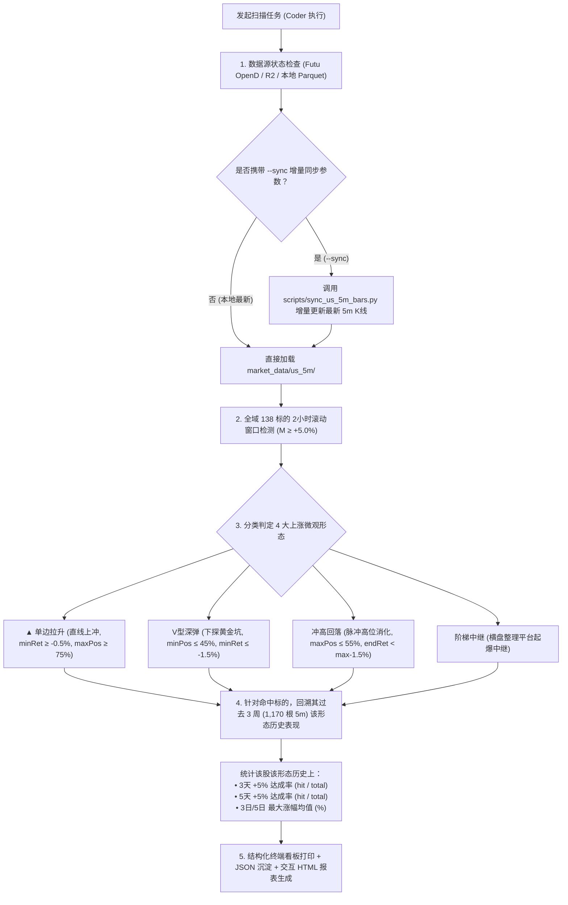

# 4 大上涨形态实时扫描与 3 周历史胜率回测技能 (scan-surge-patterns)

本 Skill 专门指导 AI Coding Agent（Coder）与量化研究员如何对 **全量 138 只标的池（自选 + 0086持仓 + 核心ETF + 产业链龙头）** 执行最新 5 分钟 K 线行情的实时扫描，提取符合 4 种微观上涨形态的标的，并自动对其触发形态执行**个股级最近 3 周（15个交易日）历史回测**，计算该形态在该股票上后续 **3 天 +5%** 与 **5 天 +5%** 的真实达标概率。

---

## 一、核心业务与量化逻辑架构



---

## 二、标准执行指令与常用命令速查

### 1. 最常用：自动增量同步最新行情并执行全量扫描
当开盘中或刚收盘，需要获取**最新数据**并扫描时，直接运行：
```bash
# 一键完成：先同步最新 5m K 线 -> 再扫描 138 标的 -> 执行 3 周回测 -> 打印看板
python3 scripts/scan_surge_patterns.py --sync
```

### 2. 离线快速扫描（基于本地已有数据，耗时 < 1 秒）
若本地 Parquet 数据已经最新，直接扫描：
```bash
python3 scripts/scan_surge_patterns.py
# 或使用快捷别名
./scripts/scan_surge_patterns
```

### 3. 指定核心关注标的定向扫描
仅扫描特定的重点标的（如自己的重仓股或核心自选）：
```bash
python3 scripts/scan_surge_patterns.py --symbols CRDO NVDA AAPL SOXL --sync
```

### 4. 调整扫描窗口或门槛参数
```bash
# 将检测窗口从默认 2 小时 (24根) 调整为 1 小时 (12根)，涨幅门槛调整为 +4%
python3 scripts/scan_surge_patterns.py --window 12 --threshold 0.04
```

---

## 三、扫描产物与交付文件规范

每次执行完成后，系统自动生成三处产物：

1. **终端 ANSI 格式化看板**：
   实时打印排名前列的标的、当前 2h 涨幅、触发时点、3 周样本数、**3 天 +5% 达成率**、**5 天 +5% 达成率** 以及标的属性（0086 持仓 / 自选关注 / 核心 ETF）。
2. **结构化 JSON 缓存**：
   [`analysis/latest_surge_scan/scan_results.json`](file:///Users/admin/Code/stock/analysis/latest_surge_scan/scan_results.json)
3. **本地只读 Web 看板**：
   [`analysis/latest_surge_scan/index.html`](file:///Users/admin/Code/stock/analysis/latest_surge_scan/index.html)  
   可通过静态服务访问：`http://127.0.0.1:8768/analysis/latest_surge_scan/index.html`

---

## 四、4 种微观上涨形态判定标准 (严格对齐代码口径)

在 2 小时（$N = 24$ 根 5m K 线）且区间涨幅 $r = \frac{p_{end} - p_0}{p_0} \ge +5.0\%$ 条件下：

| 形态名称 | 判定量化条件 | 微观博弈内涵 | 历史统计特征 |
| :--- | :--- | :--- | :--- |
| **`▲ 单边拉升`** | `minRet >= -0.5%` 且 `maxPos >= 0.75` | 几乎无回踩直线上攻，多头单边加速赶顶 | 极度亢奋追涨，容易透支短期动量，**忌追高** |
| **`V型深弹`** | `minPos <= 0.45` 且 `minRet <= -1.5%` | 前半程深探砸出黄金坑，尾盘暴力反扑创新高 | 洗盘极度彻底，高弹性标的反转爆发力最强 🔥 |
| **`冲高回落`** | `maxPos <= 0.55` 且 `endRet < maxRet - 1.5%` | 脉冲式急冲遇阻回踩消化浮筹，整体涨幅仍超+5% | 主力盘中试盘吸筹，吸收抛压后再度上攻 |
| **`阶梯中继`** | 排除上述 3 种情况后的常规上涨 | 窄幅横盘蓄势平台后二次放量起爆，阶梯式推进 | 换手充分，趋势性波段推进 |

---

## 五、个股 3 周历史胜率回测计算口径

对于当前检测到的 `(Symbol, Pattern)`：
1. **回测时间窗**：向前截取该股票过去 15 个完整交易日（常规交易时段 1,170 根 5m K 线，约合自然周 3 周）；
2. **形态提取**：在 3 周时段内使用相同口径（$N=24$ 根、$M \ge +5\%$）扫描该股票历史上触发的所有 `Pattern` 事件；
3. **无偏未来标签跟踪**：
   - **3天 +5% 达成**：以该形态结束点收盘价为买入基准，后续 3 个交易日（234 根 5m）内最高价 $\ge \text{基准价} \times 1.05$；
   - **5天 +5% 达成**：后续 5 个交易日（390 根 5m）内最高价 $\ge \text{基准价} \times 1.05$；
4. **高信度黄金标的门禁**：
   - **胜率门槛**：3 天 +5% 达成率 $\ge 75.0\%$；
   - **样本门槛**：过去 3 周内触发频次 $\ge 3$ 笔；
   - 满足此二者的标的在终端看板中被**标绿加粗**呈现，列为主选交易观察池。

---

## 六、Coder 执行避坑守则 (CRITICAL)

1. **不可跨周期混合数据**：
   5 分钟数据存储于 `market_data/us_5m/<SYMBOL>/2026.parquet`，复权格式固定为 **`NONE`（未复权原始价格）**。绝对不能与 `us_60m` 中的前复权数据交叉相除计算收益率。
2. **时序安全与防未来函数**：
   入场基准点必须严格取形态闭合那一刻（如第 24 根 5m 的收盘价）。后续 3 天 / 5 天的涨幅计算必须从第 25 根 K 线的 high 开始取最大值，严禁把当前形态内的极值计入未来收益。
3. **接口频控限制**：
   富途 OpenD 历史 K 线接口有频控保护（单标的间隔 $\ge 1.0$ 秒）。在使用 `--sync` 全量同步 138 只标的时，需等待约 1.5~2 分钟，切忌多线程并发冲击网关。
