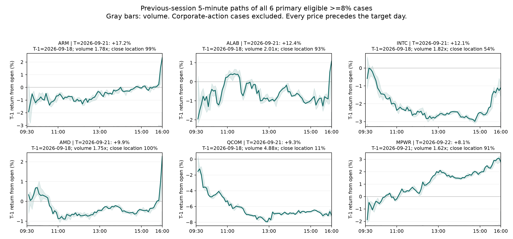
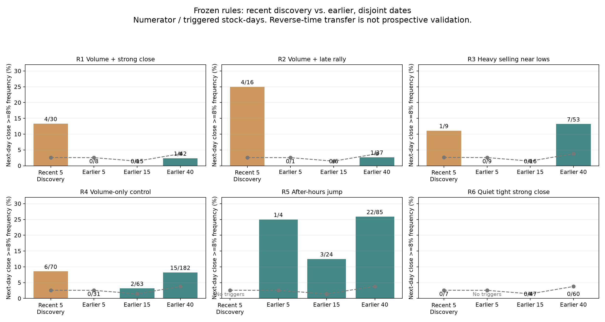

# 前一日 5 分钟行情与次日 AI 股暴涨：第一轮观测与回查

**结论：最近案例中的“放量收强”“尾盘拉升”未能迁移到较早日期；“前一日盘后涨 ≥2%”与次日全天暴涨有关，但次日开盘后追入的价格表现较差。** 这支持进一步研究盘后信息变化，不支持直接输出买入推荐。

数据已补齐至 **2026-09-25 20:00 ET**。范围为 47 只当前主题池 AI 相关美股，使用真实归档的 **5 分钟 NONE 未复权行情**。不是 1 分钟数据，也不是全市场 AI 股票。47 股当前主题回放存在成员选择偏差；COHR、VRT、ANET、CIEN 等缺本地 5m 历史，未纳入本轮。完整成员和缺失名单见 [universe.json](universe.json)。

主标签：T 日常规盘收盘较 T-1 常规盘收盘 ≥8%；辅标签：T 日常规盘最高价较前收盘 ≥10%。全部信号取自 **T-1 20:00:01 ET 之前**，不读 T 日盘前。-1 指前一交易日。相对量 = T-1 常规盘成交量 / 截至 T-2 的过去 20 个官方交易日成交量中位数（至少 10 日）。收盘位置 = (收盘−全天最低)/(全天最高−全天最低)。

常规盘/盘后须完整网格；缺失不补零。公司行动日依照事前协议从主统计剔除，不把拆分或分红因素当收益预测；这个排除仅用于事后质量控制。历史 available_at 是 bar_end+1 秒假设，尚未证明实时接收速度。

**最近 5 个交易日，先观察具体股票。** 原始价格口径共 7 例，META 9/21 除息单列；严格主样本为 231 个股票日、6 次达标、2 个目标日期。

| 目标日 | 股票 | 当日涨幅 | T-1 日涨幅 | T-1 相对量 | T-1 收盘位置 | T-1 最后1小时 | 说明 |
| --- | --- | --- | --- | --- | --- | --- | --- |
| 2026-09-21 | ARM | 17.16% | 4.04% | 1.78x | 98.80% | 2.40% | 主样本 |
| 2026-09-21 | ALAB | 12.36% | 3.30% | 2.01x | 93.31% | 2.08% | 主样本 |
| 2026-09-21 | INTC | 12.14% | -0.18% | 1.82x | 53.79% | 1.44% | 主样本 |
| 2026-09-21 | META | 11.34% | -2.43% | 1.66x | 16.87% | -1.04% | META 除息，附录 |
| 2026-09-21 | AMD | 9.95% | 2.70% | 1.75x | 99.51% | 2.73% | 主样本 |
| 2026-09-21 | QCOM | 9.29% | -5.82% | 4.88x | 10.84% | -0.51% | 主样本 |
| 2026-09-22 | MPWR | 8.06% | 4.92% | 1.62x | 90.76% | 0.82% | 主样本 |

| 目标日 | 主样本股票日 | 收盘≥8% | 盘中≥10% |
| --- | --- | --- | --- |
| 2026-09-21 | 45 | 5 | 4 |
| 2026-09-22 | 47 | 1 | 0 |
| 2026-09-23 | 46 | 0 | 0 |
| 2026-09-24 | 46 | 0 | 0 |
| 2026-09-25 | 47 | 0 | 0 |

AMD、ARM、ALAB 的强收盘主要体现为临近收盘的快速抬升；MPWR 前一天的上涨更连贯。INTC 全天开收仍下跌，但最后一小时修复 1.44%；QCOM 则是重跌后次日反弹。单看成功案例，并不存在一个共同的“全天稳步吸筹”形态。

9/18 全池 **41/47 股相对量 ≥1.5 倍，中位数 1.97 倍**，放量本身缺乏区分度。该日是标准期权到期日，日历见 [Cboe 2026 日历](https://cdn.cboe.com/resources/options/Cboe2026OPTIONSCalendar.pdf)；“日历事件可能影响放量”只是待验证解释，不能据此认定上涨原因。



**规则在较早结果打开前一次冻结。** [frozen_rules.json](frozen_rules.json) 保存时间、阈值、发现文件哈希。R1–R3 来自近期形态；R4 是单纯放量对照；R5–R6 是同时登记的补充假设，并非从最近成功案例发现。没有网格搜参或复核后调阈值。

| 规则 | 固定条件 | 最近5日 | 之前60日 | 之前60日同口径基线 |
| --- | --- | --- | --- | --- |
| R1 放量收强 | 相对量≥1.5，收盘位置≥80% | 4/30 · 13.33% | 1/65 · 1.54% | 3.09% |
| R2 放量尾盘拉升 | 相对量≥1.5，最后1小时涨≥1% | 4/16 · 25.00% | 1/44 · 2.27% | 3.09% |
| R3 放量下跌、收在低位 | 相对量≥1.5，日跌≥2%，收盘位置≤25% | 1/9 · 11.11% | 7/78 · 8.97% | 3.12% |
| R4 单纯放量对照 | 相对量≥1.5 | 6/70 · 8.57% | 17/276 · 6.16% | 3.09% |
| R5 盘后上涨 | T-1 20:00末价相对16:00收盘涨≥2% | 0/0 · — | 26/113 · 23.01% | 3.12% |
| R6 缩量窄幅收强 | 相对量≤0.8，振幅/历史中位数≤0.8，收盘位置≥70% | 0/7 · 0.00% | 0/107 · 0.00% | 3.09% |

分子为暴涨次数，分母为触发股票日；0/0 表示未触发，不是成功率 0%。各规则因特征缺失有不同可评估分母。之前 60 日主样本共 2,752 个股票日、86 次暴涨；R1/R2/R4/R6 可评估 2,685 条，R3 为 2,662 条，R5 为 2,752 条。

回查截止 9/17；9/18 已作为发现案例 T-1 被观察，剔除其目标日。下面三个复核窗口互不重叠，60 日合计仅用于汇总，不是第四份独立证据。

| 规则 | 9/11—9/17（5日） | 8/20—9/10（15日） | 6/24—8/19（40日） |
| --- | --- | --- | --- |
| R1 放量收强 | 0/8 | 0/15 | 1/42 |
| R2 放量尾盘拉升 | 0/1 | 0/6 | 1/37 |
| R3 放量下跌、收在低位 | 0/9 | 0/16 | 7/53 |
| R4 单纯放量对照 | 0/31 | 2/63 | 15/182 |
| R5 盘后上涨 | 1/4 | 3/24 | 22/85 |
| R6 缩量窄幅收强 | 0/0 | 0/47 | 0/60 |



**R5 的关联值得保留，但不是次日买入收益。** 113 次触发分布于 20 个目标日期、35 只股票。收盘暴涨 26/113=23.01%，非触发样本为 2.27%；按目标日期匹配后的提升为 2.84 倍，按日期×行业匹配后为 1.79 倍。4,000 次日期×行业内置换、6 条主标签规则的 Holm 校正 p≈0.0015。该检验依赖组内可交换性，不能证明因果或排除所有股票特性差异。

按交易日分块 bootstrap 的命中率 95% 区间约 **13.79%—38.15%**，不是个股预测置信区间。全部触发中仍有 **87/113 未达到收盘 +8%**。辅标签盘中 +10% 为 32/113=28.32%，仅作描述，未作为另一份独立显著性证据。

R3 看起来有 7/78=8.97%，但 7 次命中只集中在 6/29 和 7/30 两天；同日同行业对照后提升仅 0.98 倍，6 条规则校正 p=1。R1/R2/R4/R6 也未通过这项复核。

| R5 对应的价格表现 | 结果 |
| --- | --- |
| 26 个收盘暴涨案例中，开盘时已经涨≥8% | 17/26 |
| 全部113次：次日开盘到收盘均值 / 中位数 | −1.03% / −1.30% |
| 全部113次：次日收盘低于开盘 | 70/113 = 61.95% |
| 全部113次：次日开盘后收盘再涨≥8% | 6/113 = 5.31% |
| 全部113次：次日开盘后盘中触及再涨≥8% | 7/113 = 6.19% |
| 开盘到最低价的10%分位数 | −8.92% |
| 即使用T-1 20:00末价作参考，到次日收盘均值 / 中位数 | −0.27% / −1.75% |

这些是价格路径统计，未计点差、费用、滑点，也没有证明能按盘后末价或开盘价成交，不是交易模拟收益。T-1 盘后已上涨属于预测目标的一部分，必须重新定义“观察后剩余涨幅”才能研究可执行收益。

具体例子：8/12 NBIS 前日盘后 +7.92%，次日全天 +34.14%、开盘到收盘 +14.69%；7/30 LRCX 前日盘后 +6.60%，次日全天 +17.98%，但开盘到收盘 **−6.46%**。7/29 TER 前日盘后 +12.82%，次日开盘到收盘 **−13.18%**。这三者说明同一个关联规则可以对应完全不同的交易结果。

**行业和股票的研究优先级。** 以之前 60 日的基础事件密度决定下一轮观察池，避免只追最近一天热门板块。下列仅为当前池回放的描述性排序，尚无行业独立预测验证：

| 观察方向 | 股票池 | 历史收盘暴涨次数/股票日 | 频率 |
| --- | --- | --- | --- |
| AI 云算力 | NBIS、CRWV | 12/120 | 10.00% |
| 存储 | MU、SNDK、STX、WDC | 16/237 | 6.75% |
| 高速互连与网络 | ALAB、CRDO、LITE、MRVL、AVGO、CSCO | 16/315 | 5.08% |
| 半导体设备 | AMAT、ASML、KLAC、LRCX、TER | 11/296 | 3.72% |
| 计算芯片 | NVDA、AMD、ARM、INTC、QCOM | 10/298 | 3.36% |

最近计算芯片有 4/25=16%，但只来自 9/21 一个目标日；较早60日为3.36%。因此近期板块强弱不能直接外推。AI 云算力组只有两只股票；以上优先级是寻找更多案例的顺序，不是预期收益排名。盘后异动的观察应覆盖全池，不能只保留这些行业。

**截至 9/25 的下一交易日观察。** 47 股中 R5 没有触发，不能依据本研究推荐一份“9/28 将暴涨”名单。MSFT 满足 R1，ARM/DDOG/MSFT/QCOM 满足单纯放量 R4，TER 满足 R6；这些规则没有复核支持，仅保存为 [未验证观察记录](next_session_watchlist.csv)，不升级为买入建议。

本轮按要求采取“最近发现 → 更早回查”，属于逆时间迁移研究；存在当前主题池选择偏差、同日相关、短样本和未控制的公告事件。下一轮应冻结规则，按未来日期记录，另行检验观察后收益与成本。这次没有设置自动监控或下单。

**交付与复现。** [协议](PROTOCOL.md) · [全部统计](validation.csv) · [详细不确定性与失败案例](validation.json) · [逐次触发](all_triggers.csv) · [输入哈希](data_manifest.json) · [检查结果](audit.json)。

检查已通过：AMD/ALAB/MU 截去未来行情不改变过去特征；所有 -1 日符合官方交易日历；可用时间早于截止；开盘跳空与开收收益复合后等于全天收益；所有规则分母分子核对一致；四个展示窗口无重叠。图已逐张检查。

复现（仓库根目录；需 pandas/numpy/pyarrow，绘图另需 matplotlib）：

```bash
python3 analysis/prevday_ai_surge_v1/acquire.py
python3 analysis/prevday_ai_surge_v1/build_panel.py
python3 analysis/prevday_ai_surge_v1/evaluate.py
python3 analysis/prevday_ai_surge_v1/verify.py
python3 analysis/prevday_ai_surge_v1/plot_cases.py
python3 analysis/prevday_ai_surge_v1/make_report.py
```

行情只写本研究隔离缓存，未修改共享行情或其他研究，未上传 R2。交易日历来自 [Nasdaq](https://www.nasdaq.com/market-activity/stock-market-holiday-schedule)。冻结文件不随重新计算改写；若数据源修订，应保存新版本并与输入哈希比对。
