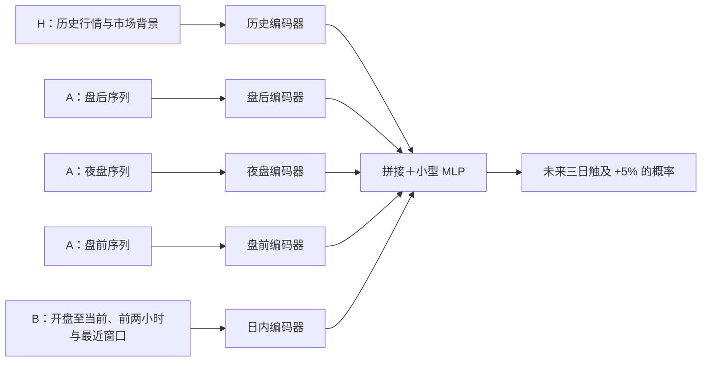

# 07 · 行情双路线训练方案：LightGBM 与多尺度 TCN

方案版本：`market_dual_track_v2`，2026-09-25。依据：用户最新确认的 A＋B 与双路线设计。状态：**已完成固定参数的首轮行情探索训练；结果见 [08 · 首轮训练启动登记](08_training_launch.md)。尚未完成完整搜索、校准或独立验证。**

## 1. 本轮决策与研究问题

**以历史背景＋A（延长时段）＋B（开盘后路径）为主方案，并行研究 LightGBM 与一个小型、多时间尺度、多分支 TCN。仅使用行情信息作为预测输入。** 两条路线共用目标、数据快照、时点、股票池、标签和时间验证窗口，比较摘要表示与序列表示的价值。

用户提供观察和猜测；研究实现者负责输入表示、有限参数搜索、验证和模型选择。“盘前可能反映事件”登记为待检验假设，不转化为“盘前权重更高”的规则。也不预设夜盘交易来自机构、已涨得多必然延续或必然透支。各时段关系与贡献方向由训练数据学习，再由样本外结果检验。

本轮不接入新闻、财报内容、事件日程、事件年龄、分析师预期或文本向量。交易日历、公司行动、股票池和行业映射仍是正确构造行情样本的必要元数据。历史监督标签用于训练和基准评估，不能成为本轮模型的输入特征；Base Heat、成熟 cohort 达成率及其预测输出也不混入主实验。

本方案替代早期“先逻辑回归、有增量再上树模型”的实现顺序；逻辑回归可以作为单独登记的诊断对照，不是启动两条路线的门槛。这里的“并行”指共同进入首轮研究计划，实际作业可按机器资源排队。

## 2. 统一命名与不变的目标

| 名称 | 输入范围 | 回答的问题 |
|---|---|---|
| **H：历史背景** | 截至上一完整常规交易时段的若干交易日走势、波动、成交量及同期市场/行业背景 | 这次变化相对过去有多异常？ |
| **A：延长时段** | 上一常规收盘至本次常规开盘之间，按实际开放日历分别保留盘后、夜盘、盘前路径 | 开盘之前发生了什么？ |
| **B：开盘后路径** | 当日常规开盘至当前 cutoff 的已完成、已可用价格和成交序列 | 前面的变化延续、放大还是回吐？ |

实验 ID 使用 `H / HA / HB / HAB`，模型 ID 使用 `lgbm / tcn`。本文的 A/B 是输入模块；早期数据讨论的四种 A/B/C/D 模型代号已停用，不能混用。

H-only 不得通过“当日摘要”“市场状态”偷带今天的开盘、盘前或盘中收益。对应市场与行业的当期路径随 A、B 一起加入；H 中只留历史背景。同样，HA 不能使用当日常规开盘价或开盘后的确认结果。时点身份、日历可作为各组共有字段；数据质量字段仅描述本组实际使用的输入，均须列入 allowlist。

主标签继续沿用 [03 · 样本、标签和特征](03_features_labels.md)：从人工延迟后的 5m Open 代理入场，累计 **1170 个正常交易分钟内触及 +5%**。延长时段可以提供输入，凌晨成交触及不计主标签成功。主时点 11:30 ET，更新至 12:30/13:30/14:30；30 秒出结果及人工延迟仍是需验证的工程假设。

模型方案与新特征 schema 升级为 v2；时间、入场及标签仍引用 v1 契约。当前 `configs/v1.json` 只驱动已有合成脚手架，不代表两条训练路线已经配置好。实现时另建带版本的训练配置，明确引用标签契约，不覆盖 v1 制品。

## 3. 共用数据与两种表示

### 3.1 时间尺度和数据质量

以审计通过的 5m、60m、日线为数据基础。历史长度、分钟粒度和窗口组合在训练区内搜索；1/3/5/10/20 个交易日、最近 1/2 小时是候选尺度，不是已经证明有效的最优窗口。5m 可按已验证的时段边界聚合成较粗粒度；不得由小时线插值出分钟路径。输入粒度的选择不改变主 entry 和 label 的 5m 口径。

A 内部的盘后、夜盘、盘前分别编码，保留时段身份、实际持续时间和间隔。周末、节假日、半日与夜盘开放资格服从版本化日历，不把休市时间铺成零收益/零成交，也不把同一根跨界 K 线重复放入两个时段。夜盘相对放量仅与历史同类时段比较，同时保留绝对量/可信成交额，避免小基数倍率误导。

B 保留三类信息：从开盘至 cutoff 的前缀、固定开盘前两小时、紧邻 cutoff 的最近窗口。11:30 后前两小时片段保持固定，完整前缀和最近窗口继续更新。不得在较早预测中使用当日完整序列或未来路径长度。

每个片段区分 `observed`、有证据的 `no_trade`、`missing`、`not_covered/not_eligible` 与 `padding`；真实低波动仍是 observed。保存可用时间、覆盖率、距上个有效观察的时间与缺失原因。只有“没有 bar”不能认定无成交。TCN 的数值填补要与有效性 mask 配套，卷积、池化和融合不得把补齐值当真实价格；LightGBM 也获得同范围的覆盖和缺失信息。

价格使用一致公司行动口径下的相对价、收益或归一化 OHLC；量可使用因果历史基准的相对量与 `log1p` 等变换。不得用标签窗口、未来日线或整个数据集拟合缩放、裁剪和填补参数。跨缺口收益注明所跨时间，不冒充单根 bar 收益。turnover/volume 未通过口径核验时禁用 VWAP 特征，两条路线同步处理。

### 3.2 LightGBM：多尺度摘要

LightGBM 读取同一 H/A/B 行情片段计算出的摘要：

- 各窗口、各时段的收益、波动、最大回撤、区间幅度与收盘位置。
- 上涨与回撤持续多久，变化集中于一根 K 线还是多个阶段。
- 前后阶段的速度、成交量变化、活跃 K 线比例和无成交/缺口持续时间。
- 延长时段涨幅在常规开盘后保留、放大或回吐多少；跨 A/B 的摘要只在 HAB 启用。
- 同时间窗口相对 QQQ、SPY、预登记行业 ETF 的变化；有足够 PIT 覆盖时再登记群体广度摘要。

摘要必须登记来源窗口及依赖模块，不能在 HB 中暗含盘前成交路径，或在 HA 中暗含开盘后回吐。B 的开盘跳空可引用 H 的上一常规收盘，但不等于看见完整 A 路径。两条路线共享相同原始观察与时间边界，便于识别信息范围是否一致。

LightGBM 作为强基线，承担快速、受控的特征消融和非线性交互检验。其官方文档说明了直方图训练、正则化与提前停止，并指出小样本下叶子优先生长可能过拟合；本项目仍需限制复杂度、按时间验证。[LightGBM 官方说明](https://lightgbm.readthedocs.io/en/stable/Features.html)

### 3.3 TCN：小型多分支序列编码

TCN 直接读取按时间排序、经过因果归一化的价格与成交序列，以及对应市场/行业序列和 mask。第一版采用以下结构：

编码器采用小型因果时间卷积，可用膨胀卷积和残差块覆盖不同时间尺度；输出定长表示后拼接，接小型融合网络与二分类输出。A 内三个时段保留独立编码分支与身份。H/A/B 消融时移除相应分支及其质量元信息，不能仅把内容置零却留下被移除模块的覆盖信号。

第一版不用注意力或动态加权替代数据定义。通道数、层数、卷积核、膨胀率、dropout、融合宽度与最大参数量，在真实运行前登记有限候选。报告各分支实际感受野及可见时间范围；若声称编码完整路径，架构/池化就必须确实覆盖该片段。padding 不进入有效池化；缓存、归一化及卷积实现都要通过前缀不变检查。

结构允许学习“盘前上涨且开盘后放量保持”与“盘前上涨但开盘后迅速回吐”的差别，不硬编码其中哪一种概率更高。[TCN 原始研究](https://arxiv.org/abs/1803.01271)为以卷积检验序列模式提供方法依据，不构成本股票任务有效性的证据。

## 4. 首轮固定的 4×2 对照

| 输入方案 | LightGBM | 小型 TCN | 用途 |
|---|---|---|---|
| H | `lgbm_H` | `tcn_H` | 历史背景基线 |
| H＋A | `lgbm_HA` | `tcn_HA` | 延长时段增量 |
| H＋B | `lgbm_HB` | `tcn_HB` | 开盘后路径增量 |
| **H＋A＋B** | **`lgbm_HAB`** | **`tcn_HAB`** | **主方案与组合价值** |

另外保留 B0 常数率与 B1 分时/预登记市场状态基准。B1 若使用当期市场状态，明确其输入范围，不能冒充 H-only 消融。八格都须有计划与结果状态；失败、数据不足和资源不足也登记，不用最成功的单格替代整组报告。

同一输入组的两种模型使用相同原始观察、标签、样本 ID 和外层日期。整组输入消融另使用预登记的共同可评估样本作配对比较，同时报告每组原始资格数、缺失率与覆盖差异。缺延长时段数据不妨碍保存 H/HB 的可用样本，但不能直接拿不同样本域的分数声称 A 有增量。不同窗口候选也记录实际样本掩码，防止长历史筛选改变比较分母。

重点比较 `HA−H`、`HB−H`、`HAB−HB`、`HAB−HA`，并报告 `HAB−H`。不能只凭 HAB 的绝对成绩判断 A/B 是否有贡献。

## 5. 参数搜索与时间隔离

完整纪律见 [04 · 训练和验证协议](04_validation.md)。外层采用同一组向前滚动评估日期；内层训练/验证完成窗口选择、超参搜索、early stopping、概率校准和阈值选择。标签结束和实际可用时间都须在边界前，跨边界样本 purge。同日股票及各决策时点归同一侧，禁止随机拆散相关样本。

| 搜索项 | 本轮范围与约束 |
|---|---|
| 共用输入 | 历史长度、已审计粒度、窗口组合、可选行情特征族；配对对照使用相同信息范围 |
| LightGBM | 叶子数/深度、叶子最小样本、学习率、最大迭代、行列采样、L1/L2；二分类目标，内层提前停止 |
| TCN | 分支通道/层数/感受野、融合宽度、dropout、学习率、weight decay、batch size、最大 epoch；二分类目标，内层提前停止 |
| 训练样本时间权重 | 默认不凭直觉偏重近期；若比较滚动训练长度或样本时间衰减，单独登记，区别于单条预测内部的多尺度记忆 |
| 校准 | 在时间隔离的内层留出或时间 OOF 上拟合，保留未校准与校准结果；不得在外层评分集上拟合 |

coder 先根据覆盖审计和小规模训练成本填写有限候选列表、每路线 trial/算时上限、种子、停止规则与参数量上限，再自动搜索。无需强求两个算法相同参数量或相同耗时，但必须记录各自搜索机会和成本；不能给一条路线无限调参后宣称其天然更优。比较表示时保留匹配窗口的对照，自动选出的不同窗口最优结果另报。

全部 trial（包括失败和提前停止）保存参数、种子、数据/代码版本、内层得分、停止轮次、耗时、内存、失败原因和模型制品位置。类别重加权或重采样若被采用，必须登记，并在原始发生率的时间留出集上评估与校准；训练输出不可直接宣称已校准概率。

外层评估不参与提前停止或该折调参。依据 development 样本外结果选择路线属于模型开发；最后冻结胜出方案后才使用未参与选择的独立测试/未来纸面数据。看过最终结果后改模型、融合权重或阈值，需要新的独立评估期。

## 6. 如何解释结果和选择模型

主指标仍为样本外 Brier，并结合 log loss、概率校准、候选 precision/coverage、风险路径、跨时期稳定性和运行成本。按配对时间块给差异区间，主时点与更新时点分别报告。所有验收数值在揭盲前填写，训练集胜率或单期最高命中率不能决定选型。

| 观察结果 | 下一步判断 |
|---|---|
| 两种模型都从 HAB 获益 | A/B 组合价值的证据更一致；仍核对覆盖、时期与不确定性 |
| 只有 TCN 稳定获益 | 序列表示值得继续研究；算法和归纳偏置也不同，尚不能仅凭这一对照把改善全部归因于路径顺序 |
| 两者样本外成绩在预登记的实用差异范围内接近 | 优先训练、维护和推理更简单的 LightGBM |
| TCN 只在训练集更好 | 优先排查泄漏、有效样本量和过拟合，减小模型或增强正则，不盲目加大结构 |
| 两者都无稳定增量 | 保留负结果，回到数据覆盖与假设；不因需要交付而挑成功时期 |

运行成本至少记录训练时间、峰值内存、制品体积、全候选池推理延迟以及数据到齐至结果生成的总时延。当前机器能否满足实时目标仍需测量；模型计算快不代表行情已按时到齐。

首轮不扩展到多种 Transformer、GRU 或用户讨论中提及的 Jev。只有现有实验暴露明确能力缺口，才提出有针对性的新增架构对照。

两条路线先分别评估，不默认集成。只有时间样本外误差确有互补，且在 development 内选择并冻结的组合在未参与模型/权重选择的数据上改善，才考虑发布集成结果。已用于挑模型的测试结果不能再充当集成的独立证明。

## 7. coder 交付顺序

1. 按 [06 · 数据采集可行性](06_data_acquisition_feasibility.md)交付本轮行情数据及元数据、覆盖与时延证据；事件采集不构成本轮依赖。
2. 在 M2 为同一组 sample IDs 构造 H/A/B 前缀、LightGBM 摘要及 TCN 序列/mask；逐字段记录时间和模块依赖，实施 v2 schema。
3. 在 M3 实现独立的 LightGBM 与 TCN 训练入口，共用数据/切分/评分接口；先完成小批工程核验，再执行预登记八格实验。
4. 在 M4 交付全量试验台账、逐条样本外预测、配对消融、校准/覆盖/风险、稳定性及成本报告，再冻结独立验证方案。

“方案已写入”“代码可运行”“真实训练完成”“历史样本外改善”“独立验证通过”分别举证，不能互相替代。

## 8. 增量提醒：个股差异与更新机制（2026-09-25）

本节记录用户确认的表述澄清，延续 v2 方案，不改目标或标签。coder 应落实为输入字段和实验登记项，不能只留下“考虑个股差异”“适应热度变化”两句原则。

**个股差异：同时保留实际水平与相对自身历史的变化。** 波动输入保留实际振幅/波动率，以及相对该股票历史同类窗口的倍数或位置；成交输入保留实际成交规模、活跃程度及相对自身历史的变化。流动性先用已审计成交额、活跃 bar 比例等行情代理。历史比较按相同时段和已过交易分钟对齐，分母只用此前已完成、当时可用的数据；零分母或历史不足保留缺失原因。

例如，同样是截至 11:30 振幅 3%，平时为 1% 与平时为 4% 的股票，应提供不同的历史相对状态，同时都保留今天实际 3% 的波动。该例只解释表示方法，不是买入阈值。LightGBM 登记成对的实际值/相对值；TCN 的归一化序列也要保留对应尺度信息，例如作为所属模块的附加输入，避免归一化抹掉个股实际波动和成交规模。两路线遵守同一信息范围及 H/A/B 消融边界。

**更新机制：盘中重新计算与模型重新训练分别登记。**

- 每个预测时点补入截至该时点已完成、已可用的行情，用当时已启用的模型版本重新计算。11:30 到 12:30 新增一小时路径属于已有 B 模块设计，不另包装为“适应热度”的新能力，也不意味着每小时重训。
- 训练历史长度、重训周期及可选的样本时间衰减，作为独立的时间对照实验。先登记有限候选，在内层向前验证中选择；外层回放按冻结的重训计划运行，每次只使用重训时已经完整成熟且可取得的标签。新模型记录训练截止与启用时间，不回写过去预测。
- 输入更新本身不能证明适应市场变化。报告需给出后续时期的概率质量、校准与稳定性证据；尚未验证时只称“已定义更新机制”。

交付提醒：M2 的特征登记列出实际值/相对值配对、历史分母与缺失规则；M3/M4 的实验登记分别列出预测更新时点和重训策略。历史回看长度、分钟粒度、训练历史长度、重训周期是不同参数，不混写成一个“窗口”。
