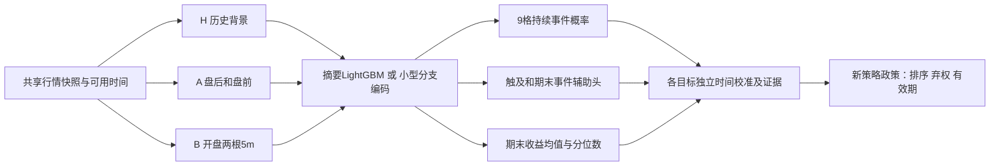

# 09:40 开盘延续模型方案

2026-09-25；状态：**方案与历史参数探索，尚未训练新模型**。策略 `opening_continuation_v1`。已有三日模型保持自身含义；此次延续此前 H/A/B 双路线与 ModelSpec→TrainingRun→PredictionSet→PolicyRun→Report 设计，新增策略任务及标签契约。

## 1. 从使用方式倒推

用户09:40左右查看开盘前两根5m结果，希望判断现在准备买入，后面是否仍有20分钟以上、幅度足以覆盖成本的上升机会。默认把“20分钟以上”从**实际延迟入场**起算；从09:30起算的20分钟走势，到09:45只剩5分钟，不能满足相同需求。

| ET时间 | 系统能力与用户动作 |
|---|---|
| 开盘前 | 缓存股票池、H历史特征、A盘前/盘后背景；校验模型及基准源 |
| 09:35 | 第一根闭合，只更新缓存，不产生本协议的入场判断 |
| 09:40 | 第二根闭合，检查它的真实到达时间及市场/行业共同水位 |
| 09:40:30 | 目标出结果时间；未到齐则显示迟到/不可用，不能用半根或旧bar补齐 |
| 09:42:30 | 沿用当前工程120秒人工延迟假设，用户可能已完成阅读和下单准备 |
| 09:45 | 主历史入场代理：start_at=09:45、源time_key=09:50的Open；它不进入09:40特征 |
| 入场后20/30/60分钟 | 分别回答剩余涨幅、延续形态、期末收益和风险；不用未来最高点当卖价 |

09:45只是5m数据可复算的成交代理；历史数据无法恢复09:42:30盘口价格。延迟参数1/2分钟在5m取整下可能落在同一入场bar，不是假装已分别测得精确1/2分钟成交。另用09:50/09:55做离散延迟敏感性。生产需要当前买卖报价、实际信号到达/查看时间及人工成交反馈，才能判断用户拿到的价格是否仍对应训练入口。

首版每天每股只在09:40评估一次入场，最多显示预登记Top-1/Top-3并允许无候选；不要求用户每5分钟重新买卖。09:45及之后的更新若用于重新入场，需要新增采样时点并训练，不能把09:40模型的旧概率重新贴在新价格上。已有持仓只显示观察，不重复入场；需要跨策略共享持仓状态时另建组合政策。

一个结果应显示：**从约定延迟入场起，未来T分钟额外上涨g且保持延续的概率**，以及期间触及概率、期末收益10/50/90分位数、净收益估计、历史同概率组实际率及样本数、参考价/数据水位/失效时间。缺验证时显示研究估计。当前09:40 Close只能作参考，最终目标价必须以实际成交价重新计算；价格偏离/迟到时不沿用旧概率。

## 2. 需要的数据能力

1. **主输入和标签：** 同源未复权5m OHLCV、官方RTH日历。首两根为结束标签09:35和09:40，09:30结束柱属于盘前。输入要求end≤cutoff且available/received≤decision；标签独立读取未来完整区间。
2. **H背景：** 前5/10/20个已完成交易日的收益、波动、量和同时间首10分钟基线。同时保留绝对强度与相对自身历史强度；缩放只在训练段拟合。跨公司行动需一致单位或明确缺失。
3. **A背景：** 上一交易日盘后、当日盘前，按时段编码、保留缺失；现有库缺夜盘，不能称具有夜盘能力。真实VWAP须验证turnover/volume，否则该特征为空。
4. **B前两根：** 每根归一化OHLC、收益、实体/上下影、量、累计收益、收盘位置、相对历史同窗量、相对QQQ/行业超额。全池广度是后续单独消融，必须满足同时间可见性。
5. **线上水位：** 开盘前持续缓存、订阅更新、真实received_at、断线补洞及修订版本，不能临时串行拉全池历史API期待30秒完成。对可用股票逐项出结果，同时展示全池到齐比例；不能以缺失股票缩小分母美化成功率。
6. **研究资格：** 现有静态名单可做“当前池历史回溯”；若检验此固定自选池的未来表现，先冻结当日可知池再前向记录。若声称历史Nasdaq-100策略效果，必须补历史入选/退出成员。两种目标不混名。

本次实证只审核B前缀及同日未来窗口，未重新认证全部H/A/行业特征完整性，也未验证实时30秒延迟。数据就绪、历史规律、预测能力和执行收益分别验收。

## 3. 涨幅、持续时间和曲线如何定义

设O为09:30 Open，C1/C2分别为09:35/09:40 Close。观察到的开盘强度：

`r10=C2/O−1`；`v1=log(C1/O)/5`；`v2=log(C2/C1)/5`；`a=(v2−v1)/5`。

v的单位是log收益/分钟，a是log收益/分钟²。`v2>v1`仅表示第二段平均涨速更快，不证明之后继续加速。两根close加开盘只有三个价位：二次函数能恰好穿过三个点，R²=1没有预测说服力；指数曲线也不能由这点信息稳定外推。OHLC提供幅度与影线信息，但不提供bar内部高低点先后。

**先用分段log价格路径及可解释形态参数，不预测一条确定的未来曲线。** 实际/相对波动、量及市场背景帮助区分同样r10在不同股票上的含义。曲线输出如果需要，显示条件收益分位数带，不画未经验证的平滑上涨轨迹。

以延迟入场价P0为零点，未来每5分钟Close记Ck，`zk=log(Ck/P0)`、z0=0，n=T/5：

`R_T=Cn/P0−1`

`ER_T=|zn| / Σ|zk−z(k−1)|`（平价路径设0）

`Late_T=(zn−z[n−floor(n/2)])/zn`（zn≤0时不满足）

首轮形态标签：

`Y_sustain(T,g)=1[R_T≥g 且 ER_T≥0.5 且 Late_T≥0.25]`。

含义：到窗口结束仍保留目标涨幅，路径有方向性，并且后半段贡献至少四分之一涨幅。允许正常回撤；不等于20分钟逐秒单调上涨，也无法保证bar内未快速反转。它是**持续机会的一个可操作代理定义**，不是自然界唯一的上涨周期。用ER=0.3/0.5/0.7、Late=0/0.25/0.5检查标签敏感性应另登记；本次主审计只运行0.5/0.25，不声称选出最优曲线参数。

同步保留两个较宽事件：`Y_touch=1[max(high)/P0−1≥g]`、`Y_terminal=1[R_T≥g]`，并分别保留MFE、MAE、close回撤和首次触及5m时间区间。不能把触及概率标为可获利概率，也不能把预入场上涨算作可捕获收益。

新模型第一轮拟用T=20/30/60分钟、g=0.5/1/1.5%共9格；30分钟+1%是预设主锚点，45分钟和2%以上保留探索对照。最终训练前依据审计的样本密度与使用目标冻结；选择这些值属于开发选择，无独立最优性。

不同T的持续标签**不是嵌套事件**，P(30分钟持续)未必≤P(20分钟持续)，不能强制概率单调。固定T的目标幅度事件具有嵌套关系；检查g增大时概率不升。只有另行定义“首次趋势失效时间”的生存模型才能得到单调S(t)，不能把本标签偷换成生存概率。主联合事件直接建模，不假设幅度与持续时间独立后相乘。

## 4. 模型结构

以新标签重新训练H/HA/HB/HAB×LightGBM/小型TCN，继续已有两路线信息消融。**全池合格股票日都是训练样本**；r10筛选仅作简单基准和政策候选，不预先删掉平开、下跌、后来上涨或失败样本。第一轮也不继承“三日历史触及率>60%”质量门槛，那是另一个任务的目标统计。

**LightGBM：** 每个(T,g)用独立小分类头，共享样本、特征和时间折；收益用各T的均值回归及10/50/90分位数回归。候选复杂度先固定小范围（例如7/15叶、最小叶样本100/300），正式配置在拟合前登记，不在外层追着结果扩展。

**TCN：** H及A沿用小型时间卷积分支思想；B只有两根，采用共享小投影+两时点有序拼接或kernel=2的短卷积，不给它用需要几十根才能解释的“前两小时/最近一小时”输入。两路线拥有相同原始信息，TCN新增收益/多目标头需单独实现；不能把旧单输出checkpoint更改输出名即当新模型。类别重采样/加权若试验，要在原始发生率上校准，默认不做。

考虑每日约百行、日期有效样本很少，第一版不叠加大型Transformer、单股独立网络或自动混合专家。共享**数据与工程接口**，各策略独立标签、校准和权重。跨策略共享编码器/迁移学习须再比较负迁移；当前三日模型的分数不直接输入新模型。如未来确有增量，必须用时间前向OOF三日分数训练。

## 5. 接入现有多策略工程

已有[产物契约10](../../docs/10_artifact_and_replay_contract.md)明确五类实体及版本；[07](../../docs/07_model_training_plan.md)已有H/A/B两路线。这是复用基础，但当前还没有完整通用多策略运行器：

| 当前代码 | 发现的具体边界 | 新策略怎么接 |
|---|---|---|
| `hourly_v3_time.resolve_time` | 默认六小时节点及旧有效期 | 新ScheduleSpec=09:40；依据新入场政策定义有效期，09:45到期后旧入场报告不能继续行动 |
| `hourly_v3_data.build_bundle` | HORIZON_BARS=234；B含前两小时/最近1h；原标签为+5% | 共用读源/日历/可用时间思想，新增opening特征及标签构建器；不改旧builder语义 |
| `inference_hourly_v3.load_artifact` | 校验hourly_v3 schema、B长度72及旧支持时点 | 按StrategySpec解析schema/time/label，拒绝不匹配制品；旧loader继续服务旧策略 |
| `train_hourly_v3`及既有校准 | 可复用时间切分、训练日志、模型存储原则 | 新训练入口与目标头、按日权重和嵌套选择；重训/校准单独登记 |
| `terminal_risk_v4.evaluate_complete_path` | 明确要求234根；期末风险面向三日未触及组 | 复用净收益/ES数学工具，新增T分钟全样本期末收益头，不能复用三日失败条件风险模型 |
| `export_dashboard_v1.export` | 拒绝非after_open_3d5pct_v1标签 | 扩展版本化报告adapter及指标标题/单位；不能只新增ModelSpec行就假装兼容 |

建议新增`StrategySpec`（策略层）引用已有`ModelSpec`（算法/输入层），字段至少包括strategy_id/version、schedule_id、feature_schema、label_contract、target_grid、entry_policy、evaluation_protocol、supported_cutoffs、model/calibration manifest、policy/version及evidence_status。PredictionSet每行携strategy/target(T,g)/entry政策/预测种类/校准版本，避免不同目标使用同名p_hit互相覆盖。

现有模型作为`three_day_touch`任务，新模型作为`opening_continuation`任务，可共用SnapshotStore、Calendar、Universe、数据有效性、前向日志、切分及指标工具。路由首先由用户选的任务和支持时间决定；不按两种不同事件概率的数值大小挑策略。日后做跨策略资金选择，须同一净收益/风险/持有期口径和共享仓位状态机。

新模块拟放本目录下`features.py / labels.py / train.py / inference.py / policy.py`；本次只交付audit与方案，以上模块尚未实现。先保持可替换接口，不在本轮大范围抽取旧WIP公共层。

## 6. 评价函数：分三层，不用一个胜率包办

### A. 拟合目标

概率头用不额外重加权类别的BCE；同日股票总权重相同，避免覆盖多的日期主导。若共享网络，主格(30min,1%)权重0.5，其余8格各0.0625；这是建议的冻结开发权重而非实测最优。收益分位数用pinball，均值用平方误差。LightGBM可独立拟合各头，不强行混合不同单位的loss；TCN先分别验证概率头，收益辅助训练的权重另作为有限内层消融。

### B. 概率模型的选择与发布评价

主评分建议**按日等权的多目标Brier**：

`BS = (1/D) Σ_d [(1/N_d) Σ_i Σ_j w_j (p_ij−y_ij)^2]`。

与同日期同样本B0/B1作配对：B0训练期发生率；B1按当时可见r10、历史同窗波动、QQQ首10分钟状态分桶的平滑发生率，桶边界/回退只在训练期拟合。这样才能区分“模型会挑本来波动大的股票”和真正预测延续的增量。额外比较只按r10排名及09:40简单形态规则。

报告主格及每格Brier/log loss、PR-AUC与当期基准率、可靠性分箱、样本/日期数。Brier同时混合校准、区分度和事件不确定性，不能单独证明概率可信，需配可靠性图和分箱区间。[scikit-learn官方校准说明](https://scikit-learn.org/stable/modules/calibration.html)

校准按时间更晚但早于外层的独立段拟合；保留raw/sigmoid两种，是否校准只能内层选择，样本不足允许identity且标原始估计。目标幅度一致性与分位数交叉处理也在内层确定；校准后重新评分，不事后修形后沿用旧分数。

建议独立概率验收门槛（待训练登记落实，当前未通过）：至少60个连续前向交易日、≥1000合格股票日、主标签≥100个正例；主格相对B0和B1的配对Brier改善95%区间下界均>0，多格加权Brier不恶化；主要非空可靠性分箱至少100行且实际率/均值差≤5个百分点，同时报告日期块区间。数量不足是证据不足，不能以高正确率通过。60日仅是启动评估的最低数量，不自动保证检验功效。

### C. 使用政策的评价

对于低频人工使用，核心指标是**每日Top-1/Top-3在允许弃权后的precision、误报次数、机会召回和无候选日比例**。同一天、同数量、同数据合格域对比r10排名和B1排名；不能模型仅选1只却拿全池平均作唯一基准。量化上涨者的召回分母限09:40可观测域，另报之前已经涨完的不可捕获机会。

收益层第一版保留固定T分钟期末Close估值；执行回放另从期末bar闭合、数据到齐并出结果后加120秒人工延迟，取之后首个5m bar的Open退出（30秒出结果假设下通常为T+5分钟），并另做多等一根的压力测试。不能使用刚刚闭合时刻已经发生的下一根Open冒充收到结果后的成交；估值与延迟退出结果分开。不能选择未来最高价、未来最好T，不能把本次期末估值当真实成交。可另登记固定目标限价退出研究，但5m high只说明碰到过价格，不能证明该限价单会成交。[Investor.gov订单类型说明](https://www.investor.gov/introduction-investing/investing-basics/how-stock-markets-work/types-orders)

成本净值：`R_net=(P_exit/P_entry)×(1−c_sell)/(1+c_buy)−1`，所有未达标者完整计入；报告均值、胜率、最差5%平均损失ES95、持有时间及真实可操作的退出延迟。MAE用于解释路径，不自动成为止损或打分惩罚。10/20/40bp往返成本仅是假设压力场景，未来需用用户实际费用和开盘报价估计。

若需要政策选择函数，可采用**最大化验证期净收益均值，约束Top-K、误报预算和ES95**；没有用户风险预算时保留收益/风险/频率的Pareto对照，不随意设一个综合评分宣称适合实盘。首轮可用“20bp成本情景下收益均值的日期块95%下界>0、对同数量基线有增量、再在40bp压力场景不转负”作为开发研究门槛；仍需另审实际可执行性与风险预算。

概率表现好却没有净收益可保留预测模型；概率门槛和政策门槛分别给状态。没有模型超过简单基准、或前向收益为负，都是允许的结论。

## 7. 验证与实施顺序

1. **本轮：** 参数/标签密度探索与代码架构映射；完整分母、固定网格和延迟/成本统计，不拟合模型。
2. **数据与标签实现：** 冻结最终(T,g,ER,Late)、候选池、当时可见字段与entry/exit政策。特征、outcome、eligibility分表；验证首两根、DST/半日、缺失/零量、价格基准、窗口完整、未来/迟到追加不改变旧特征与预测。
3. **受控训练：** 建议开发外层June/July/August/September逐月向前。每折使用此前数据，并进一步按时间拆拟合、早停/有限参数搜索、校准、政策选择。现有2026所有月份都是exposed；不是独立验证。内层日期和最小样本在开训前根据数量填齐，不足则减少复杂度/标证据不足，不能随机拆散同日股票。
4. **标签purge：** 用实际label_end与available_at而非旧策略固定3日；本策略同日短窗口通常在下一日边界前成熟。若引入延迟退出、跨日动作或成熟历史标签特征，按其真实可用时间重新purge。H的20日回看无需机械地删去评估前20天，重点是输入因果及标签边界。
5. **不确定性：** 整个交易日横截面一起重采样，5/10日块敏感性，零信号日保留；报告股票集中度、月份及波动状态。记录全部候选数；探索网格不逐格宣称显著。正式主假设固定，辅助多重比较用Holm或留出新独立期。
6. **冻结前向：** 模型、校准、阈值/Top-K、最大延迟、失效条件、成本、目标选择政策同时冻结，之后开始连续未来只读记录。多目标分别有效还不够，按这些概率挑T/g的完整选择规则也需要前向验收。
7. **看板接入：** 新策略页明确09:40、剩余分钟和涨幅锚点，支持打开逐股两根输入和完整事后路径；前向未成熟留pending。新模型仍由用户手动执行，不接自动下单。

交付结论应分别标注：数据审计、开发期模型比较、独立概率证据、政策执行证据；没有任何一项用其他项代替。
